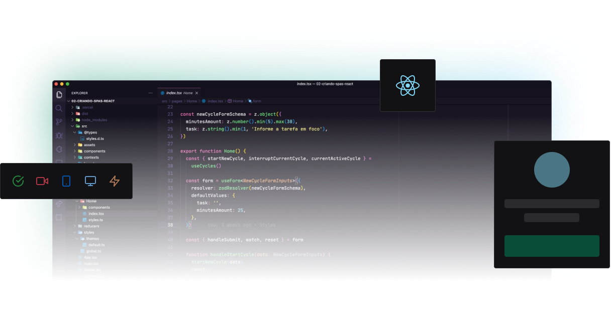

  

    An project build during Ignite Lab event - ReactJS made by Rocketseat.

  

## ⚛️ Tools

- [ReactJS](https://reactjs.org/): A Front-end JS library used to build interfaces.
- [TailwindCSS](https://tailwindcss.com/): A utility-first CSS framework packed with classes like flex, pt-4, text-center and rotate-90 that can be composed to build any design, directly in your markup.
- [GraphQL](https://graphql.org/): Is a query language for APIs and a runtime for fulfilling those queries with your existing data.
- [GraphCMS](https://graphcms.com/): GraphCMS gives you instant GraphQL Content APIs to create, enrich, unify, and deliver your content across platforms.
- [ViteJS](https://vitejs.dev/): Next Generation Frontend Tooling.
- [Apollo Client](https://www.apollographql.com/docs/react/): is a comprehensive state management library for JavaScript that enables you to manage both local and remote data with GraphQL.
- [VimeJS](https://vimejs.com/): Vime is a customizable, extensible, accessible and framework agnostic media player.
- [Phosphor Icons](https://phosphoricons.com/): Phosphor is a flexible icon family for interfaces, diagrams, presentations — whatever, really.
